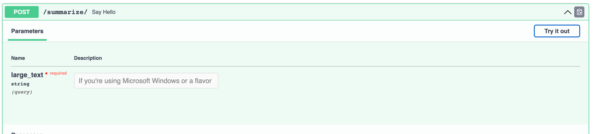
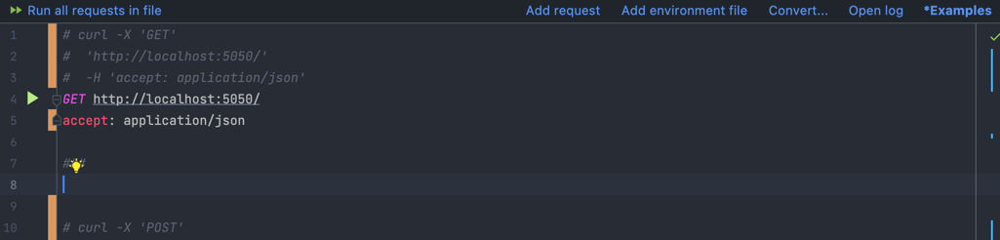

## Task 2
### Hi, Human!

This model was chosen because most of my time as a researcher is taken up by reading various articles. Very often I use different variations of summarization models to optimize my time. 

To check if the application is running, run the application with the command `docker-compose up`

Go to http://localhost:5050/docs in your browser or run `test_main.http` file which located in webapp/manual_tests or use `api_test notebook`.

1. If you select first option, please use `Try it out` button and put some large text into field 
2. If you select second option and your user of JetBrains, then try run `test_main.http`